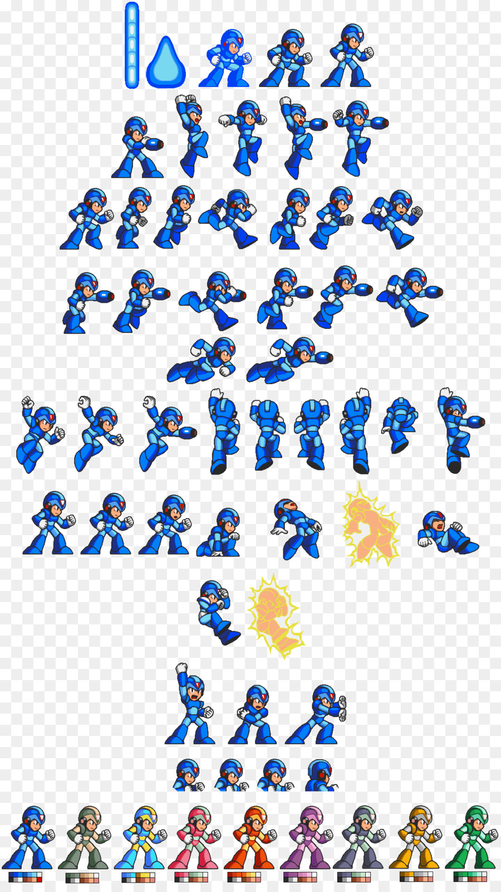
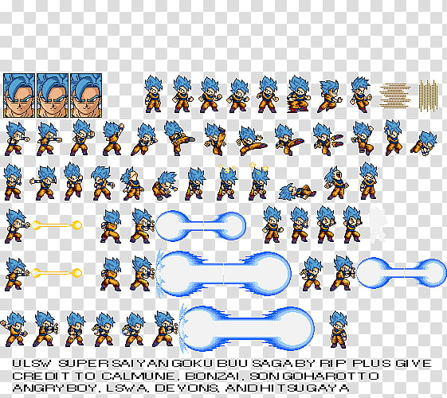
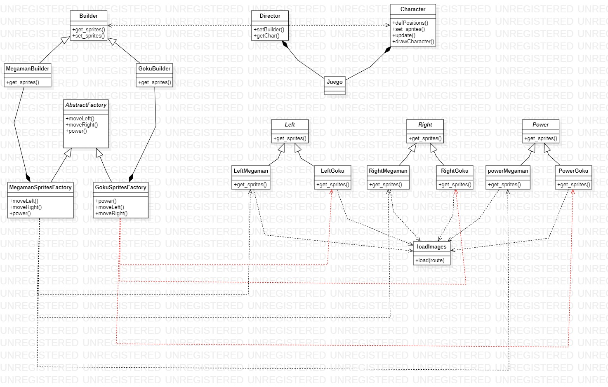

# Implementación de patrones de diseño en un videojuego
## Desarrolladores
Este desarrollo fue realizado por 
> Julián Esteban Mendoza Wilches, 20182020054

> Reinaldo Espinel Torres, 20182020015

**Universidad Distrital Francisco José de Caldas**

**Modelos de Programación I**
 
 **Docente**: Alejandro Paolo Daza
## Descripción
Este proyecto consiste en la implemnetación de dos patrones de diseño creacionales, en este caso **Abstract Factory** y **Builder**, el resultado final de este (el proyecto) es la creación de  dos mas personajes los cuales se puedan mover en un escenario y demostrar un poder cualquiera. El proyecto se realiza en pyhton y se usan funciones de pygame para poder desarrolarlo.
Algunas imagenes de los sprites de los personajes.
> Megaman

>Goku

## Diagrama de clases
Este es nuestro diagram de clases realizado con la herramienta STAR UML
